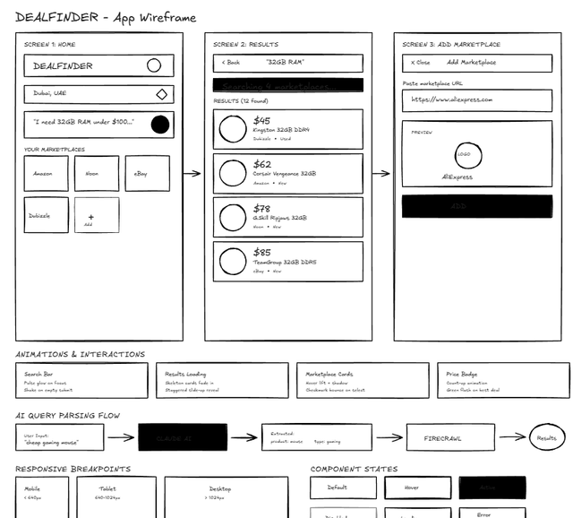
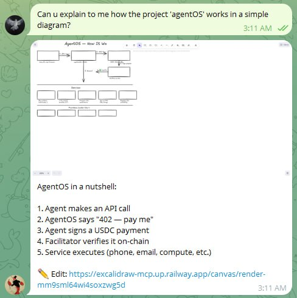

# Excalidraw MCP Server & Agent Skill

Let your AI agent run a live Excalidraw canvas and draw diagrams. This repo provides:

- **MCP Server**: Connect via Model Context Protocol (Claude Desktop, Cursor, Claude Code, etc.)
- **Agent Skill**: Portable skill for OpenClaw agents and other skill-enabled agents

> Built on top of [mcp_excalidraw](https://github.com/yctimlin/mcp_excalidraw) by [@yctimlin](https://github.com/yctimlin). Added shareable links, image export, agent skill, and a hosted API.

## Demo



*AI agent creates a wireframe via MCP tools*



*OpenClaw agent renders a diagram and sends it to Telegram with an edit link*

## Hosted Instance

A public instance is running at `https://excalidraw-mcp.up.railway.app` — no setup needed.

```json
{
  "mcpServers": {
    "excalidraw": {
      "url": "https://excalidraw-mcp.up.railway.app/mcp"
    }
  }
}
```

## Self-Hosting

### Local

```bash
git clone https://github.com/0xArtex/excalidraw-mcp.git
cd excalidraw-mcp
npm install
npm run build
npm run canvas
```

Server starts at `http://localhost:3000`.

### Docker

```bash
docker build -f Dockerfile.canvas -t excalidraw-mcp .
docker run -p 3000:3000 -e PUBLIC_URL=https://your-domain.com excalidraw-mcp
```

### Environment Variables

| Variable | Default | Description |
|----------|---------|-------------|
| `PORT` | `3000` | Server port |
| `PUBLIC_URL` | auto-detected | Public URL for edit links |
| `CANVAS_BASE_URL` | `http://localhost:3000` | Internal URL for renderer (auto-resolved) |
| `RATE_LIMIT_RPM` | `10` | Rate limit per IP per minute |
| `MAX_ELEMENTS` | `2000` | Max elements per render request |
| `RENDER_TIMEOUT_MS` | `300000` | Render timeout (5 min) |

## Configure MCP Clients

The MCP server can be connected via Streamable HTTP (hosted) or stdio (local).

### Claude Desktop

**Hosted:**
```json
{
  "mcpServers": {
    "excalidraw": {
      "url": "https://excalidraw-mcp.up.railway.app/mcp"
    }
  }
}
```

**Local (node):**
```json
{
  "mcpServers": {
    "excalidraw": {
      "command": "node",
      "args": ["/path/to/excalidraw-mcp/dist/index.js"],
      "env": {
        "EXPRESS_SERVER_URL": "http://localhost:3000"
      }
    }
  }
}
```

### Claude Code

```bash
claude mcp add excalidraw --scope user \
  -e EXPRESS_SERVER_URL=http://localhost:3000 \
  -- node /path/to/excalidraw-mcp/dist/index.js
```

### Cursor

Config location: `.cursor/mcp.json`

```json
{
  "mcpServers": {
    "excalidraw": {
      "url": "https://excalidraw-mcp.up.railway.app/mcp"
    }
  }
}
```

## Agent Skill

For OpenClaw and other skill-enabled agents, install the skill to render diagrams with a single API call — no MCP client needed.

The skill is available at [`skills/excalidraw-canvas/`](skills/excalidraw-canvas/) or can be installed from [ClawhHub](https://clawhub.ai/0xArtex/excalidraw-canvas).

See [`SKILL.md`](skills/excalidraw-canvas/SKILL.md) for usage — it's a single `curl` call.

## MCP Tools

| Tool | Description |
|------|-------------|
| `start_diagram` | Start a new diagram session, returns live canvas URL |
| `create_element` | Create a shape (rectangle, ellipse, diamond, arrow, text, line) |
| `batch_create_elements` | Create multiple elements at once |
| `delete_element` | Remove an element |
| `finish_diagram` | Finalize and get shareable link with image |

## Development

```bash
npm run dev        # Watch + hot reload
npm run build      # Build everything
npm run type-check # TypeScript check
```

## License

MIT

## Acknowledgments

- [@yctimlin](https://github.com/yctimlin) - Original [mcp_excalidraw](https://github.com/yctimlin/mcp_excalidraw) project
- [Excalidraw](https://excalidraw.com/) - The drawing library
- [Model Context Protocol](https://modelcontextprotocol.io/) - The MCP specification
